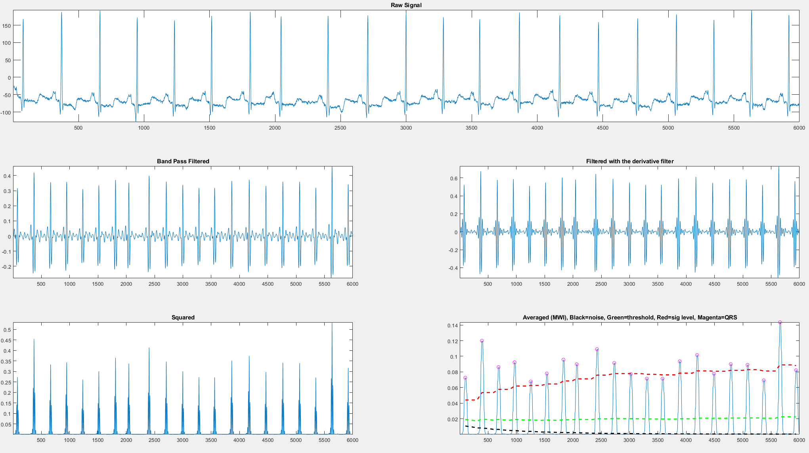
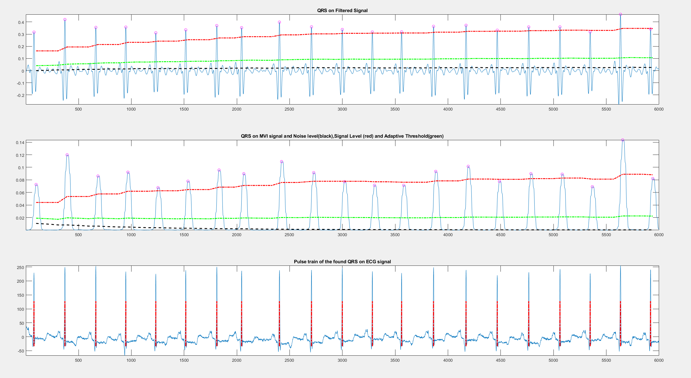

# Pan–Tompkins QRS Detection (Bandpass Butterworth – MATLAB)

This repository provides a **MATLAB implementation of the Pan–Tompkins algorithm** for **QRS complex detection** [1] in electrocardiogram (ECG) signals.

The implementation follows the classical signal-processing pipeline proposed by Pan and Tompkins, using a **Butterworth bandpass filter** and adaptive decision logic. The algorithm is validated using ECG recordings from the **MIT-BIH Arrhythmia Database** [2], a standard benchmark widely adopted in the literature.

---

## Algorithm Overview

The implemented processing chain consists of the following stages:

1. **Bandpass filtering (5–15 Hz)**  
   Removes baseline wander and high-frequency noise while preserving QRS energy.

2. **Derivative operation**  
   Enhances the slope information associated with the QRS complex.

3. **Squaring operation**  
   Nonlinear amplification of dominant peaks and suppression of small variations.

4. **Moving Window Integration (MWI)**  
   Extracts waveform energy over a physiological time window (~150 ms).

5. **Adaptive thresholding and decision logic**  
   Includes noise estimation, signal level tracking, T-wave discrimination, and search-back mechanism.

---

## Project Structure

```text

├── .git/
├── .github/
├── data/
│   └── ECG_MIT_01.mat
├── figure/
│   ├── 01.png
│   └── 02.png
├── functions/
│   ├── pan_tompkin.m
│   ├── plot_signal_window.m
│   └── thresholding_BP_MWI.m
├── .gitignore
├── main.m
└── README.md
```

---

# Directory and File Description

.git/
Git repository metadata.

.github/
GitHub configuration files (workflows, issue templates, etc.).

data/
Input data used for testing and validation.

ECG_MIT_01.mat: ECG sample derived from the MIT-BIH Arrhythmia Database.

figure/
Folder containing generated figures and plots.

functions/
MATLAB function files used in the project.

pan_tompkin.m: Complete implementation of the Pan–Tompkins QRS detection algorithm.

plot_signal_window.m: Utility function for ECG visualization within a fixed window (e.g., 6000 samples).

thresholding_BP_MWI.m: Adaptive thresholding and decision logic operating on bandpass and MWI signals.

main.m
Main execution script used to run the complete ECG processing pipeline.

---

# Visualization Results

The figures below illustrate the main stages of the Pan–Tompkins algorithm and the resulting QRS detection.

<p align="center">
  
</p>


This figure shows the ECG processing pipeline, including bandpass filtering, derivative, squaring, and moving window integration.

<p align="center">
  
</p>


This figure presents the detected QRS complexes over the processed ECG signals, highlighting adaptive thresholds and detected R-peaks.

---

# ECG Database — MIT-BIH Arrhythmia Database

The ECG signals used for testing and validation can be obtained from the MIT-BIH Arrhythmia Database, one of the most widely used public datasets for evaluating QRS detection algorithms.

Official website (PhysioNet):
https://physionet.org/content/mitdb/1.0.0/

Dataset Description

The MIT-BIH Arrhythmia Database consists of 48 half-hour two-channel ambulatory ECG recordings, digitized under the following conditions:

Sampling frequency: 360 Hz

Resolution: 11-bit

Typical leads: MLII and modified V5

This dataset has become a de facto standard benchmark for ECG analysis and QRS detection studies, including evaluations of the Pan–Tompkins algorithm.

How to Download the Dataset

The ECG recordings can be obtained directly from PhysioNet in multiple formats:

WFDB format (.dat, .hea, .atr)

MATLAB-compatible files

MATLAB-exported data

CSV (via PhysioNet tools)

---

# Reference

[1] J. Pan and W. J. Tompkins,  **A Real-Time QRS Detection Algorithm**, *IEEE Transactions on Biomedical Engineering*, vol. BME-32, no. 3, pp. 230–236, March 1985.

[2] G. B. Moody and R. G. Mark, **The impact of the MIT-BIH Arrhythmia Database**, *IEEE Engineering in Medicine and Biology Magazine*, vol. 20, no. 3, pp. 45–50, 2001.